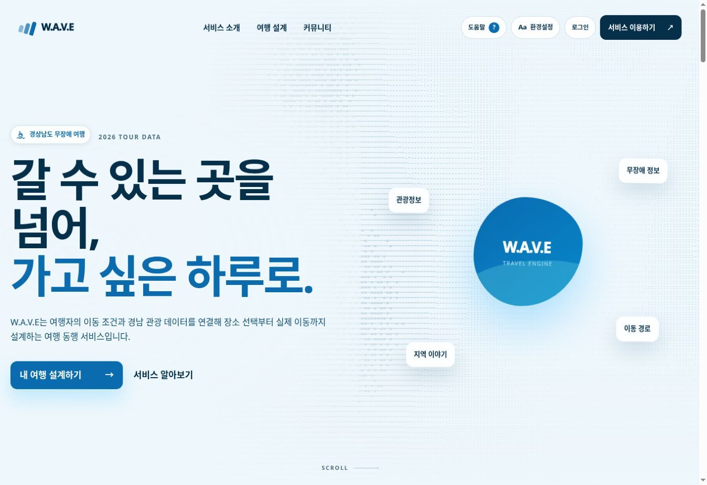
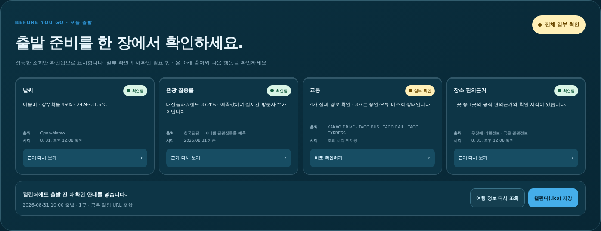
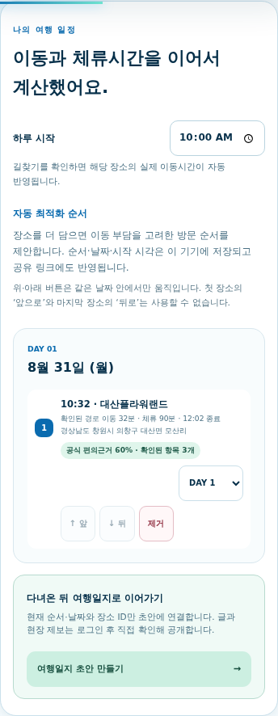
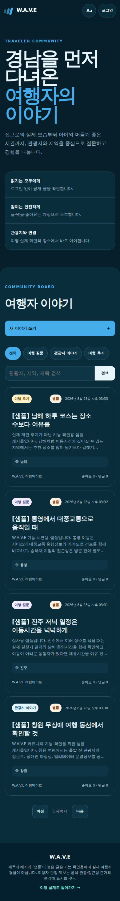
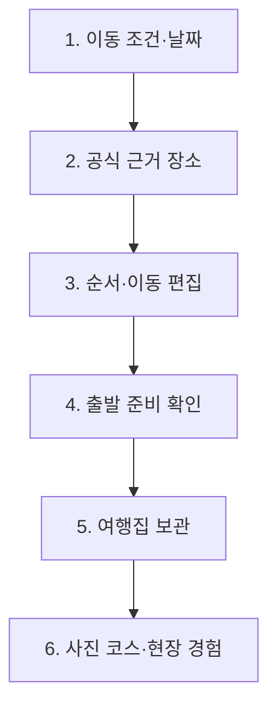
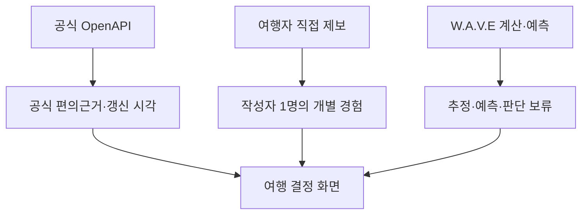
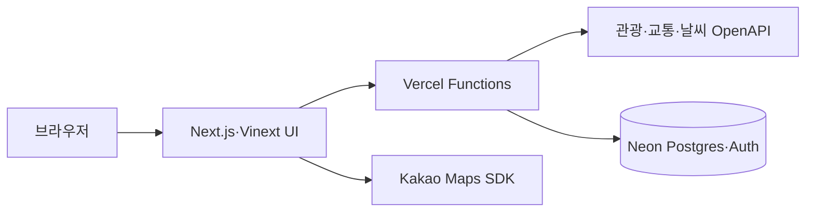

<div align="center">
  
  <h1>W.A.V.E</h1>
  <p><strong>경남 18개 시·군을 잇는 데이터 기반 무장애 여행 설계 플랫폼</strong></p>
  <p>Where Accessibility, Voyage and Evidence meet.</p>

  <p>
    <a href="https://wave-barrier-free-gyeongnam.vercel.app/"></a>
    <a href="https://wave-barrier-free-gyeongnam.vercel.app/api/health"></a>
  </p>

  <p>
    <a href="https://github.com/jeongiryang/wave-barrier-free-gyeongnam/actions/workflows/ci.yml"></a>
    <a href="https://github.com/jeongiryang/wave-barrier-free-gyeongnam/actions/workflows/cd.yml"></a>
    <a href="https://github.com/jeongiryang/wave-barrier-free-gyeongnam/releases"></a>
    
    
  </p>
</div>

---

## 1분 안에 보는 W.A.V.E

W.A.V.E는 “갈 수 있는 관광지 목록”이 아니라, **내 이동 조건에 맞는 장소를 공식
근거로 고르고 실제 이동·일정·출발 직전 확인까지 이어 주는 경남 무장애 여행 설계
플랫폼**입니다.

플래너의 **Journey Control Center**는 새 여행자에게 한 번에 한 질문만 보여 줍니다.
`어떤 여행이 편안할까요? → 왜 이 장소가 맞을까요? → 어떤 순서가 편할까요? →
지금 출발해도 괜찮을까요?`를 따라가며, 익숙한 사용자는 언제든 **전체 보기**로 모든
지도·교통 도구를 펼칠 수 있습니다. 데스크톱에서는 현재 단계·완료 조건·다음 행동을
왼쪽 레일에 고정하고, 모바일에서는 44px 하단 단계 탐색으로 바꿉니다. 상단 브리핑은
편의조건, 공식 추천, 저장한 장소, 현재 경로를 요약하며 `확인됨 / 일부 확인 /
재확인 필요`의 의미를 먼저 설명합니다.

| 여행자가 묻는 것 | W.A.V.E의 결정 화면 | 거짓 확신을 막는 기준 |
| --- | --- | --- |
| 내가 갈 수 있는가? | 선택한 편의조건과 장소별 일치 근거 | 공식 긍정 근거가 없으면 일반 추천·자동 일정에서 분리 |
| 어떻게 이동하는가? | 실제 경로·직선거리 추정·외부 확인을 구분한 교통 비교 | 미확인 시간·요금·무료 여부를 숫자로 만들지 않음 |
| 어떤 순서로 갈 것인가? | 날짜·시각·장소 순서를 직접 편집하는 일정 보드 | 드래그 없이 키보드 버튼으로도 같은 작업 가능 |
| 지금 출발해도 되는가? | 날씨·혼잡 예측·교통·장소 근거를 모은 출발 준비 카드 | 조회 실패와 승인 상태를 `확인됨`으로 올리지 않음 |
| 여행 뒤에는 무엇을 남길까? | 계정 없이 이 기기에 보관하는 여행집·메모·사진 코스 | 원본 사진·GPS·정확한 출발지·계정 정보를 저장하지 않음 |
| 다른 여행자는 어땠는가? | 장소별 구조화 현장 제보와 여러 장소 여행일지 | 작성자 1명의 경험으로 표시하고 공식 점수와 분리 |

이 프로젝트는 **2026 관광데이터 활용 공모전 ②-2 웹·앱 구현 부문**의
**지정과제 1 — 여행 중 날씨·혼잡·동선 변화 대응**에 반응형 웹으로 제출합니다.
사실이 아닌 수상·성과·사용자 수는 적지 않습니다.

| 바로 실행 | 검증 문서 |
| --- | --- |
| [프로덕션 서비스](https://wave-barrier-free-gyeongnam.vercel.app/) | [3분 시연 동선과 실패 대안](docs/demo-script.md) |
| [로그인 없는 여행 설계](https://wave-barrier-free-gyeongnam.vercel.app/planner) | [공모전 요구사항 정합성](docs/contest-compliance.md) |
| [런타임 API 상태](https://wave-barrier-free-gyeongnam.vercel.app/api/health) | [운영·데이터 정책](docs/competition-operation-policy.md) |

## 실제 화면

아래 이미지는 목업이 아닌 Production 캡처입니다. 데스크톱·모바일, 밝은·어두운
화면에서도 같은 정보 계층과 키보드 흐름을 유지합니다.

| 서비스 진입 | 근거·일정·출발 준비 |
| --- | --- |
|  |  |
|  |  |

## 검증 가능한 핵심 기능

| 영역 | 실제 화면 | 제공 기능 | 운영 상태 |
| --- | --- | --- | --- |
| Journey Control Center | [`/planner`](https://wave-barrier-free-gyeongnam.vercel.app/planner) | 질문형 단계 안내·전체 보기 전환, 현재 단계·준비도·다음 행동·정보 상태 범례, 데스크톱 고정 레일과 모바일 하단 탐색 | 운영 중 |
| 여행 조건·프로필 | [`/planner#conditions`](https://wave-barrier-free-gyeongnam.vercel.app/planner#conditions) | 휠체어·보행·영유아·임산부·시각·청각 조건 다중 선택, 이 기기에만 저장하는 재사용 프로필 | 운영 중 |
| 관광 탐색 | [`/planner#places`](https://wave-barrier-free-gyeongnam.vercel.app/planner#places) | 경남 18개 시·군 공식 관광사진·무장애 편의정보·근거 있는 추천과 추가 탐색 분리 | 운영 중 |
| 일정 보드 | [`/planner#places`](https://wave-barrier-free-gyeongnam.vercel.app/planner#places) | 날짜·시작 시각·장소 순서 직접 편집, 이동·체류시간 연쇄 계산, 공유·여행일지 초안 | 운영 중 |
| 내 여행집 | [`/travel-book`](https://wave-barrier-free-gyeongnam.vercel.app/travel-book) | 완성한 일정을 이 기기에 보관, 갈 여행·다녀온 여행 구분, 로컬 메모, 플래너 복원·사진 코스·후기 연결 | 운영 중 |
| 출발 준비 | [`/planner`](https://wave-barrier-free-gyeongnam.vercel.app/planner) | 날씨·혼잡 예측·교통·장소 근거 상태, 재조회, 공유 URL 포함 `.ics` 저장 | 운영 중 |
| 지도·교통 | [`/planner#navigation`](https://wave-barrier-free-gyeongnam.vercel.app/planner#navigation) | 카카오맵·Leaflet, 주변 장소, 자동차·철도·버스·환승 비교와 외부 확인 | 승인된 키별 제공 |
| 상황 대응 | [`/planner#layers`](https://wave-barrier-free-gyeongnam.vercel.app/planner#layers) | 여행일 날씨·관광 집중률이 일정에 주는 영향과 대체 테마·장소 비교 | 운영 중 |
| 사진 코스 | [`/photo-course`](https://wave-barrier-free-gyeongnam.vercel.app/photo-course) | 사진 EXIF를 기기에서 읽어 방문 순서를 복원하고 공식 장소를 다시 확인 | 운영 중 |
| 여행자 이야기 | [`/community`](https://wave-barrier-free-gyeongnam.vercel.app/community) | 공개 읽기, 로그인 글·댓글·좋아요·신고, 장소별 구조화 제보·다중 장소 여행일지 | 운영 중 |
| 접근성·설치 | `환경설정` | 키보드, 44px 조작, 다크 모드, 동작 감소, 명시적 PWA 설치 버튼 | 운영 중 |
| 다국어·계정 | `/login`, `/register` | 한국어 전체 지원, 영어·일본어·중국어·프랑스어·독일어·러시아어 주요 조작 Beta, Neon Auth 계정 | 비한국어 Beta |

계정은 글쓰기·댓글·좋아요에만 필요합니다. 관광 탐색·추천·지도·일정·출발 준비·
공유는 로그인 없이 사용할 수 있습니다.

## 서비스 흐름



조건을 바꾸면 별도의 제출 버튼을 다시 누르지 않아도 추천 코스가 갱신됩니다.
각 결과에는 공식 데이터와 W.A.V.E가 조합한 판단을 구분하고, 가능한 경우
업데이트 시각·신뢰도·제공기관 상태를 함께 표시합니다.

교통 제공기관이나 데이터셋에서 응답을 받았다는 사실은 실제 출발지→목적지 경로가
확인됐다는 뜻이 아닙니다. 출발 준비 화면은 제공기관 응답 수와 실제 이동 경로를
분리하고, 실제 시간은 이동 화면에서 수단별로 확인하게 합니다.

### 3분 데모

1. `창원중앙역 → 창원 → 자연·휴양 → 휠체어 이용·걷기 불편`을 선택합니다.
2. 공식 근거 추천과 추가 탐색 장소가 분리되는지 확인합니다.
3. 장소 두 곳을 보관해 날짜·시각·순서를 바꾸고 실제 이동과 추정을 비교합니다.
4. 출발 준비 카드에서 네 출처의 상태를 읽고 `.ics`를 저장합니다.
5. 일정을 여행집에 보관하고 다녀온 여행·메모·사진 코스·후기로 이어지는지 확인합니다.
6. 장소 현장 제보가 공식 점수와 분리되는 것을 확인합니다.

전체 멘트, 심사 체크포인트와 API·지도·공유 실패 시 대체 동선은
[3분 시연 동선](docs/demo-script.md)에 정리했습니다.

## 공식 근거·경험·추정은 합치지 않습니다



| 종류 | 화면 표현 | 점수·추천 반영 |
| --- | --- | --- |
| 공식 관광·무장애 데이터 | 제공기관, 확인 항목, 갱신 시각 | 긍정 근거가 있는 항목만 반영 |
| 여행자 현장 제보 | 방문일, 작성일, 작성자 1명, 확인/달라짐/미확인 | 공식 점수에 합산하지 않음 |
| 직선거리·기본 체류시간 | `추정`, `임시`, 계산 기준 | 실제 경로처럼 표시하지 않음 |
| 관광 집중률 | 예측 기준일과 `실시간 방문자 수 아님` | 일정 영향 참고값으로만 사용 |
| 조회 실패·값 없음 | `재확인 필요`, `시간 정보 없음` | 0원·무료·안전으로 해석하지 않음 |

## 시스템 구성



- **UI:** React 19, Next.js 16 App Router 호환 구조, Vinext, TypeScript
- **빌드:** Vite 8, Nitro, Vercel Build Output API
- **지도:** Kakao Maps JavaScript SDK, Kakao REST API, Leaflet
- **데이터:** 한국관광공사·공공데이터포털·KORAIL·TAGO·ODsay·Open-Meteo
- **영속 저장:** Neon Serverless Postgres와 Neon Auth
- **운영:** GitHub Actions CI·CD, Vercel Production, Node.js 22

## 데이터 원칙

- 한국관광공사와 공공데이터포털의 원본 응답은 실시간 호출하며 DB에 복제하지 않습니다.
- Neon에는 공유 여행의 조건·공식 장소 ID·날짜 배정, 접근성 제보, 커뮤니티 글·댓글·좋아요처럼 서비스가 직접 만든 최소 데이터만 저장합니다.
- 커뮤니티 DB에는 표시 이름과 Neon Auth 사용자 참조 ID만 저장하며 이메일·비밀번호는 저장하지 않습니다.
- 공유 여행 데이터는 운영 정책에 따라 30일 뒤 만료됩니다. 만료된 공유 여행은 매일 예약 정리되고 저장 요청 때도 보완 정리되며, 만료 이후에는 조회되지 않습니다.
- 공유 링크를 열 때 저장한 장소 ID를 한국관광공사 API에서 다시 확인하므로 원본 관광정보를 복제하거나 오래된 설명을 그대로 보관하지 않습니다.
- 사용자의 GPS 좌표는 브라우저 안에서만 사용하고 서버·DB에 저장하지 않습니다.
- 내 여행집은 최대 20개 여행의 일정·상태·메모와 공식 관광사진 URL만 이 기기의 브라우저에 보관합니다. 사용자 원본 사진·EXIF GPS·정확한 출발 좌표·계정 정보는 넣지 않습니다.
- 공식 인증, 제공기관 응답, W.A.V.E의 편의조건 일치율을 화면에서 구분합니다.
- 장소별 여행자 현장 제보는 공식 근거와 별도 JSON 필드로 저장하고 추천 점수에 합산하지 않습니다.
- 편의조건 일치율은 사용자가 고른 조건 중 공식 데이터에서 긍정적으로 확인된 비율입니다. 확인된 항목이 하나도 없으면 숫자를 만들지 않고 `판단 보류`로 표시합니다.

## 설치와 현재 한계

W.A.V.E는 기존 Web App Manifest를 사용합니다. 지원 브라우저에서는 `환경설정 →
앱으로 설치`를 눌러 설치할 수 있습니다. 버튼이 보이지 않으면 브라우저 메뉴의
`홈 화면에 추가`를 사용합니다. 설치 프롬프트를 자동으로 띄우지 않습니다.

- 철도·버스·환승은 공급자 키의 승인 범위와 당일 응답에 따라 일부만 제공될 수 있습니다.
- 날씨는 예보 제공 범위 밖 날짜를 확인됨으로 표시하지 않습니다.
- 관광 집중률은 예측값이며 실시간 방문자 수가 아닙니다.
- `[샘플]` 커뮤니티 글은 기능 확인용이며 실제 이용자 경험으로 세지 않습니다.
- 비한국어 화면은 주요 소개·조작 중심의 Beta이며 관광지 원문은 한국어일 수 있습니다.
- W.A.V.E는 시설 운영 여부와 여행 안전을 보증하지 않습니다. 출발 전 운영기관 정보를 다시 확인해야 합니다.

<details>
<summary><strong>로컬 실행·환경 변수 펼치기</strong></summary>

## 로컬에서 실행하기

### 요구 사항

- Node.js `22.13.0` 이상
- npm
- Git

### 설치와 실행

```bash
git clone https://github.com/jeongiryang/wave-barrier-free-gyeongnam.git
cd wave-barrier-free-gyeongnam
npm ci
cp .env.example .env.local
npm run dev
```

Windows PowerShell에서는 환경 파일을 다음처럼 복사합니다.

```powershell
Copy-Item .env.example .env.local
```

기본 개발 주소는 `http://localhost:3000`입니다. 포트가 이미 사용 중이면
터미널에 표시되는 실제 주소를 사용합니다.

## 환경 변수

실제 키는 `.env.local`, Vercel Environment Variables 또는 GitHub Secret에만
저장하고 커밋하지 않습니다.

| 변수 | 필요도 | 사용처 |
| --- | --- | --- |
| `TOUR_API_SERVICE_KEY_ENCODED` | 핵심 | 관광·무장애·사진·행사·숙박 OpenAPI |
| `KAKAO_MAP_JAVASCRIPT_KEY` | 핵심 | 브라우저 지도 SDK |
| `KAKAO_REST_API_KEY` | 핵심 | 장소 검색·자동차 경로 서버 호출 |
| `KORAIL_API_KEY` | 선택 | 철도 정보; 승인 범위에 따라 공통 공공데이터 키 사용 가능 |
| `TAGO_API_KEY` | 선택 | 버스·터미널·도착 정보; 공통 키 사용 가능 |
| `ODSAY_API_KEY` | 선택 | 대중교통 경로 보강 |
| `EXPRESSWAY_API_KEY` | 선택 | 고속도로 정보 보강 |
| `DATABASE_URL` | 저장 기능 | Neon pooled Postgres 연결 문자열 |
| `NEON_AUTH_BASE_URL` | 계정 기능 | Neon Auth 엔드포인트 |
| `NEON_AUTH_COOKIE_SECRET` | 계정 기능 | 32자 이상의 쿠키 서명 비밀값 |
| `COMMUNITY_MODERATOR_USER_IDS` | 커뮤니티 운영 | 신고 목록을 처리할 Neon Auth 사용자 ID 목록 |

전체 발급·배포 순서는 [Vercel·Neon 설정 안내](docs/vercel-neon-setup.md)를 참고하세요.

</details>

<details>
<summary><strong>품질 검사·배포·저장소 구조 펼치기</strong></summary>

## 품질 검사와 배포

PR마다 `CI`가 다음 검사를 새 커밋 기준으로 실행합니다.

```bash
npm run lint
npm run typecheck
npm test
npm run test:e2e
npm run build:vercel
```

브라우저 회귀 테스트는 데스크톱·모바일 Chromium에서 랜딩·인트로·Planner·일정·
오류 복구·로그인 경계·커뮤니티 접근 권한과 주요 접근성 규칙을 확인합니다. 지역별
공식 사진 조회 범위는 `npm run check:photos`로 18개 시·군 표본을 점검할 수 있습니다.

모든 검사가 성공하고 브랜치가 최신 `main`을 반영한 경우에만 squash merge합니다.
병합 뒤 `CD`가 CI 성공을 확인하고 동일 커밋을 Vercel Production에 배포합니다.
Vercel 자체 Git 배포는 중복 배포를 막기 위해 비활성화되어 있습니다.

릴리즈는 병합 PR 한 건을 한 버전 단위로 기록합니다. `feat:`는 minor,
`fix:`·`docs:`·`chore:`는 patch를 올립니다. 자세한 정책과 백필 상태는
[시맨틱 버전 이력](docs/releases.md)에서 확인할 수 있습니다.

## 저장소 구조

```text
app/                    페이지, 레이아웃, API 라우트
components/             지도·사진·도움말·환경설정 UI
features/               Planner·Community 기능별 서비스·도메인 로직
lib/auth/               Neon Auth 클라이언트·서버 세션 경계
lib/community/          커뮤니티 공통 타입·입력 검증
migrations/             Neon Postgres 정식 스키마 변경
server/                 환경·HTTP·공공데이터 client와 관광·교통·날씨·장소 제공기관 모듈
worker/index.ts         도메인 handler만 연결하는 최상위 API 라우터
public/                 정적 SVG와 파비콘
tests/, e2e/            순수 로직·운영 정책과 실제 브라우저 사용자 여정 회귀 테스트
scripts/                Vercel 빌드와 시맨틱 릴리즈 도구
docs/                   공모전·배포·정책·AI 작업 로그
.github/workflows/      CI, CD, 릴리즈 자동화
```

검색엔진용 canonical·Open Graph·robots·sitemap과 설치 가능한 웹앱 manifest도
App Router 메타데이터 라우트에서 프로덕션 주소를 단일 기준으로 제공합니다.

</details>

## 협업 규칙

1. 작업 전 `main`을 최신 상태로 맞추고 작업별 브랜치를 만듭니다.
2. 하나의 논리적 변경은 하나의 PR로 분리합니다.
3. PR 작성자를 담당자로 지정하고, 작성자를 제외한 `syt83`, `unknownamed`를 가능한 범위에서 모두 리뷰어로 요청합니다.
4. 저장소의 기존 라벨 중 변경 성격에 맞는 라벨을 하나 이상 붙이고 `docs/ai-logs/PR-xxx.md`를 기록합니다.
5. 최신 `main` 대비 diff, 충돌, 리뷰 의견과 새 CI 결과를 확인합니다.
6. 실패·대기 중 검사는 우회하지 않고 성공한 경우에만 병합합니다.

세부 기준은 [최신 main 동기화 검토 정책](docs/main-sync-review-policy.md)과
[AI 작업 로그 안내](docs/ai-logs/README.md)를 따릅니다.

## 관련 문서

- [3분 시연 동선과 실패 대안](docs/demo-script.md)
- [역대 수상작 참고 레포 선별·적용 기록](docs/award-reference-review.md)
- [공모전 요구사항 정합성](docs/contest-compliance.md)
- [공모전 운영·데이터 정책](docs/competition-operation-policy.md)
- [모바일 제공 형태 결정 기록](docs/mobile-app-decision.md)
- [Vercel·Neon 배포 설정](docs/vercel-neon-setup.md)
- [디자인 시스템](docs/design-system.md)
- [시맨틱 버전 이력](docs/releases.md)
- [PR별 AI 작업 로그](docs/ai-logs/README.md)

## 참고 API와 플랫폼

- [한국관광공사 TourAPI](https://api.visitkorea.or.kr/)
- [공공데이터포털](https://www.data.go.kr/)
- [Kakao Maps API](https://apis.map.kakao.com/)
- [Vercel](https://vercel.com/docs)
- [Neon](https://neon.com/docs)
- [Vinext](https://github.com/cloudflare/vinext)

---

<div align="center">
  <strong>W.A.V.E — 모두의 이동 조건이 여행의 시작점이 되도록.</strong><br />
  <a href="https://wave-barrier-free-gyeongnam.vercel.app/">지금 W.A.V.E 열기</a>
</div>
