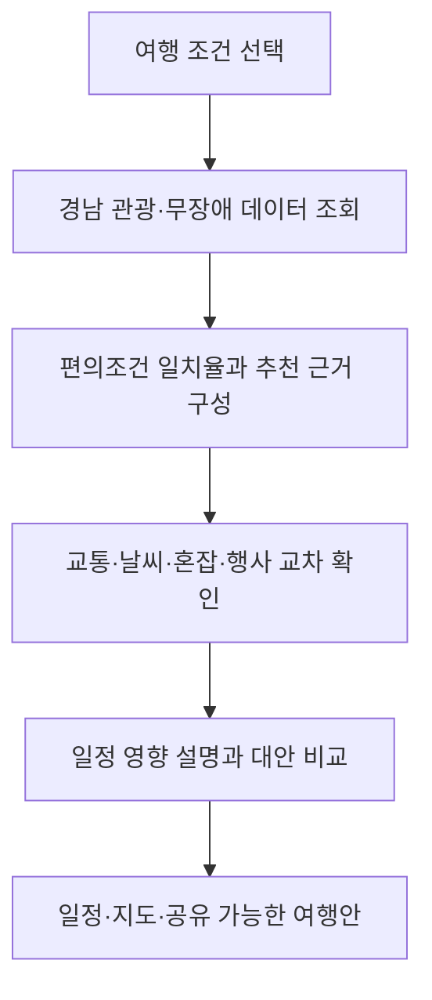
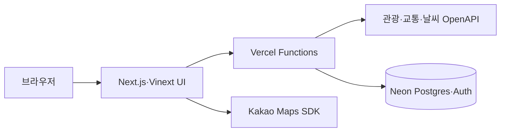

<div align="center">
  
  <h1>W.A.V.E</h1>
  <p><strong>경남 18개 시·군을 잇는 데이터 기반 무장애 여행 설계 플랫폼</strong></p>
  <p>Where Accessibility, Voyage and Evidence meet.</p>

  <p>
    <a href="https://wave-barrier-free-gyeongnam.vercel.app/"></a>
    <a href="https://wave-barrier-free-gyeongnam.vercel.app/api/health"></a>
  </p>

  <p>
    <a href="https://github.com/jeongiryang/wave-barrier-free-gyeongnam/actions/workflows/ci.yml"></a>
    <a href="https://github.com/jeongiryang/wave-barrier-free-gyeongnam/actions/workflows/cd.yml"></a>
    <a href="https://github.com/jeongiryang/wave-barrier-free-gyeongnam/releases"></a>
    
    
  </p>
</div>

---

## 프로젝트 소개

W.A.V.E는 “갈 수 있는 관광지” 목록에서 멈추지 않고, 여행자의 이동 조건과
공식 관광 데이터를 함께 비교해 **장소 선택부터 실제 이동과 일정 구성까지**
이어 주는 반응형 웹 서비스입니다.

경상남도 18개 시·군의 관광지·사진·무장애 편의시설·교통·날씨·혼잡·축제·숙박
정보를 한 흐름으로 연결합니다. 휠체어 이용, 보행 불편, 영유아 동반, 임산부,
시각·청각 정보 지원 등 서로 다른 여행 조건을 추천과 경로 설계에 반영합니다.

이 프로젝트는 **2026 관광데이터 활용 공모전 ②-2 웹·앱 구현 부문**의
**지정과제 1 — 여행 중 날씨·혼잡·동선 변화 대응**에 반응형 웹으로 제출합니다.

| 바로 보기 | 문서 |
| --- | --- |
| [프로덕션 서비스](https://wave-barrier-free-gyeongnam.vercel.app/) | [공모전 요구사항 정합성](docs/contest-compliance.md) |
| [런타임 API 상태](https://wave-barrier-free-gyeongnam.vercel.app/api/health) | [운영·데이터 정책](docs/competition-operation-policy.md) |
| [GitHub Releases](https://github.com/jeongiryang/wave-barrier-free-gyeongnam/releases) | [Vercel·Neon 설정](docs/vercel-neon-setup.md) |

## W.A.V.E가 제공하는 것

| 영역 | 제공 기능 | 운영 상태 |
| --- | --- | --- |
| 여행 조건 | 휠체어·보행·영유아·임산부·시각·청각 지원 조건의 다중 선택 | 운영 중 |
| 관광 탐색 | 경남 18개 시·군 관광지, 공식 사진, 무장애 편의정보와 추천 근거 | 운영 중 |
| 여행 설계 | 조건 변경 즉시 코스 갱신, 일정·장소 비교, 공유 링크 | 운영 중 |
| 지도·이동 | 카카오맵, 주변 장소, 자동차 경로, 로드뷰, Leaflet 경로 지도 | 키 설정 시 운영 |
| 대중교통 | KORAIL·TAGO·ODsay 기반 철도·버스·환승 정보와 예상 시간·비용 | 승인된 키별 제공 |
| 현장 대응 | 여행일 날씨·관광 집중률의 일정 영향 설명, 대체 테마·장소 경로 비교 | 운영 중 |
| 접근성 | 키보드 탐색, 반응형 화면, 다크 모드, 동작 감소, 파동 효과 설정 | 운영 중 |
| 다국어 | 한국어와 영어·일본어·중국어 간체·번체·프랑스어·독일어·러시아어 소개·주요 조작 | 비한국어 Beta |
| 계정 | Neon Auth 이메일 로그인·회원가입·로그아웃 | 운영 중 · 여행 설계는 비로그인 가능 |
| 여행자 이야기 | 공개 글 읽기, 로그인 글·댓글·좋아요, 지역·관광지 연결 | 운영 중 |

정식 계정 화면은 `/login`, `/register`, 여행자 이야기는 `/community`에서 이용합니다.
계정은 글쓰기·댓글·좋아요에만 필요하며 관광 탐색·추천·지도·일정·공유는 로그인 없이
사용할 수 있습니다. 로그인 화면은 W.A.V.E 전용 계정임을 명시하고 같은 출처의 Neon
Auth 경로만 사용해 과거 Safe Browsing 오탐 위험을 줄였습니다.

## 서비스 흐름



조건을 바꾸면 별도의 제출 버튼을 다시 누르지 않아도 추천 코스가 갱신됩니다.
각 결과에는 공식 데이터와 W.A.V.E가 조합한 판단을 구분하고, 가능한 경우
업데이트 시각·신뢰도·제공기관 상태를 함께 표시합니다.

## 시스템 구성



- **UI:** React 19, Next.js 16 App Router 호환 구조, Vinext, TypeScript
- **빌드:** Vite 8, Nitro, Vercel Build Output API
- **지도:** Kakao Maps JavaScript SDK, Kakao REST API, Leaflet
- **데이터:** 한국관광공사·공공데이터포털·KORAIL·TAGO·ODsay·Open-Meteo
- **영속 저장:** Neon Serverless Postgres와 Neon Auth
- **운영:** GitHub Actions CI·CD, Vercel Production, Node.js 22

## 데이터 원칙

- 한국관광공사와 공공데이터포털의 원본 응답은 실시간 호출하며 DB에 복제하지 않습니다.
- Neon에는 공유 여행의 조건·공식 장소 ID·날짜 배정, 접근성 제보, 커뮤니티 글·댓글·좋아요처럼 서비스가 직접 만든 최소 데이터만 저장합니다.
- 커뮤니티 DB에는 표시 이름과 Neon Auth 사용자 참조 ID만 저장하며 이메일·비밀번호는 저장하지 않습니다.
- 공유 여행 데이터는 운영 정책에 따라 30일 뒤 만료됩니다.
- 공유 링크를 열 때 저장한 장소 ID를 한국관광공사 API에서 다시 확인하므로 원본 관광정보를 복제하거나 오래된 설명을 그대로 보관하지 않습니다.
- 사용자의 GPS 좌표는 브라우저 안에서만 사용하고 서버·DB에 저장하지 않습니다.
- 공식 인증, 제공기관 응답, W.A.V.E의 편의조건 일치율을 화면에서 구분합니다.
- 편의조건 일치율은 사용자가 고른 조건 중 공식 데이터에서 긍정적으로 확인된 비율입니다. 확인된 항목이 하나도 없으면 숫자를 만들지 않고 `판단 보류`로 표시합니다.

## 로컬에서 실행하기

### 요구 사항

- Node.js `22.13.0` 이상
- npm
- Git

### 설치와 실행

```bash
git clone https://github.com/jeongiryang/wave-barrier-free-gyeongnam.git
cd wave-barrier-free-gyeongnam
npm ci
cp .env.example .env.local
npm run dev
```

Windows PowerShell에서는 환경 파일을 다음처럼 복사합니다.

```powershell
Copy-Item .env.example .env.local
```

기본 개발 주소는 `http://localhost:3000`입니다. 포트가 이미 사용 중이면
터미널에 표시되는 실제 주소를 사용합니다.

## 환경 변수

실제 키는 `.env.local`, Vercel Environment Variables 또는 GitHub Secret에만
저장하고 커밋하지 않습니다.

| 변수 | 필요도 | 사용처 |
| --- | --- | --- |
| `TOUR_API_SERVICE_KEY_ENCODED` | 핵심 | 관광·무장애·사진·행사·숙박 OpenAPI |
| `KAKAO_MAP_JAVASCRIPT_KEY` | 핵심 | 브라우저 지도 SDK |
| `KAKAO_REST_API_KEY` | 핵심 | 장소 검색·자동차 경로 서버 호출 |
| `KORAIL_API_KEY` | 선택 | 철도 정보; 승인 범위에 따라 공통 공공데이터 키 사용 가능 |
| `TAGO_API_KEY` | 선택 | 버스·터미널·도착 정보; 공통 키 사용 가능 |
| `ODSAY_API_KEY` | 선택 | 대중교통 경로 보강 |
| `EXPRESSWAY_API_KEY` | 선택 | 고속도로 정보 보강 |
| `DATABASE_URL` | 저장 기능 | Neon pooled Postgres 연결 문자열 |
| `NEON_AUTH_BASE_URL` | 계정 기능 | Neon Auth 엔드포인트 |
| `NEON_AUTH_COOKIE_SECRET` | 계정 기능 | 32자 이상의 쿠키 서명 비밀값 |

전체 발급·배포 순서는 [Vercel·Neon 설정 안내](docs/vercel-neon-setup.md)를 참고하세요.

## 품질 검사와 배포

PR마다 `CI`가 다음 검사를 새 커밋 기준으로 실행합니다.

```bash
npm run lint
npm run typecheck
npm test
npm run build:vercel
```

모든 검사가 성공하고 브랜치가 최신 `main`을 반영한 경우에만 squash merge합니다.
병합 뒤 `CD`가 CI 성공을 확인하고 동일 커밋을 Vercel Production에 배포합니다.
Vercel 자체 Git 배포는 중복 배포를 막기 위해 비활성화되어 있습니다.

릴리즈는 병합 PR 한 건을 한 버전 단위로 기록합니다. `feat:`는 minor,
`fix:`·`docs:`·`chore:`는 patch를 올립니다. 자세한 정책과 백필 상태는
[시맨틱 버전 이력](docs/releases.md)에서 확인할 수 있습니다.

## 저장소 구조

```text
app/                    페이지, 레이아웃, API 라우트
components/             지도·사진·도움말·환경설정 UI
features/               Planner·Community 기능별 서비스·도메인 로직
lib/auth/               Neon Auth 클라이언트·서버 세션 경계
lib/community/          커뮤니티 공통 타입·입력 검증
migrations/             Neon Postgres 정식 스키마 변경
server/                 환경·HTTP·공공데이터 client와 날씨·장소 검색 제공기관 모듈
worker/index.ts         관광·교통·저장 API 라우팅과 오케스트레이션
public/                 정적 SVG와 파비콘
tests/                  운영 정책·기능 회귀 테스트
scripts/                Vercel 빌드와 시맨틱 릴리즈 도구
docs/                   공모전·배포·정책·AI 작업 로그
.github/workflows/      CI, CD, 릴리즈 자동화
```

검색엔진용 canonical·Open Graph·robots·sitemap과 설치 가능한 웹앱 manifest도
App Router 메타데이터 라우트에서 프로덕션 주소를 단일 기준으로 제공합니다.

## 협업 규칙

1. 작업 전 `main`을 최신 상태로 맞추고 작업별 브랜치를 만듭니다.
2. 하나의 논리적 변경은 하나의 PR로 분리합니다.
3. PR 작성자를 담당자로 지정하고, 작성자를 제외한 `syt83`, `unknownamed`를 가능한 범위에서 모두 리뷰어로 요청합니다.
4. 저장소의 기존 라벨 중 변경 성격에 맞는 라벨을 하나 이상 붙이고 `docs/ai-logs/PR-xxx.md`를 기록합니다.
5. 최신 `main` 대비 diff, 충돌, 리뷰 의견과 새 CI 결과를 확인합니다.
6. 실패·대기 중 검사는 우회하지 않고 성공한 경우에만 병합합니다.

세부 기준은 [최신 main 동기화 검토 정책](docs/main-sync-review-policy.md)과
[AI 작업 로그 안내](docs/ai-logs/README.md)를 따릅니다.

## 관련 문서

- [공모전 요구사항 정합성](docs/contest-compliance.md)
- [공모전 운영·데이터 정책](docs/competition-operation-policy.md)
- [Vercel·Neon 배포 설정](docs/vercel-neon-setup.md)
- [디자인 시스템](docs/design-system.md)
- [시맨틱 버전 이력](docs/releases.md)
- [PR별 AI 작업 로그](docs/ai-logs/README.md)

## 참고 API와 플랫폼

- [한국관광공사 TourAPI](https://api.visitkorea.or.kr/)
- [공공데이터포털](https://www.data.go.kr/)
- [Kakao Maps API](https://apis.map.kakao.com/)
- [Vercel](https://vercel.com/docs)
- [Neon](https://neon.com/docs)
- [Vinext](https://github.com/cloudflare/vinext)

---

<div align="center">
  <strong>W.A.V.E — 모두의 이동 조건이 여행의 시작점이 되도록.</strong><br />
  <a href="https://wave-barrier-free-gyeongnam.vercel.app/">지금 W.A.V.E 열기</a>
</div>
