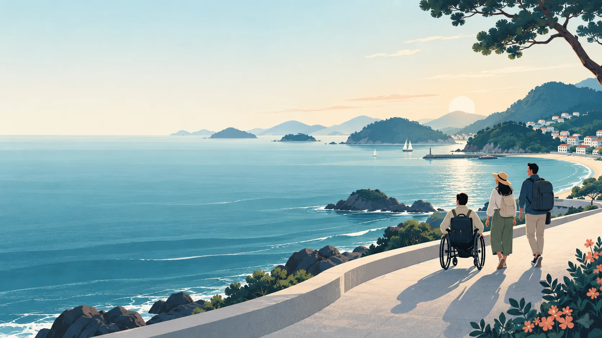
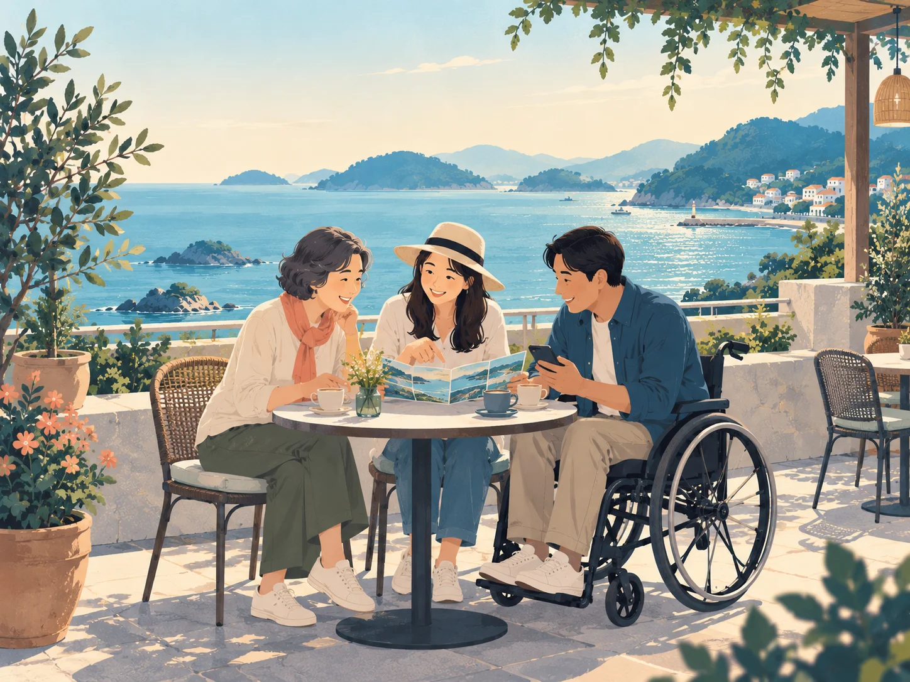

# W.A.V.E 남해안 브랜드 미디어 키트 v1

제작일: 2026-09-07. 사용자 요청으로 만든 후속 디자인 자산입니다. 현재 운영 화면에 반영된 결과가 아닙니다. 적용 담당: #257(소개·문서), #259(모션). #334 출시 차단 결함을 먼저 처리합니다.

- [웹용 이미지](wave-coast-hero.webp): 약 158 KiB. 최초 대화에서 생성한 이미지를 WebP 품질 85로 변환했습니다.
- [8초 루프 영상](wave-coast-loop.mp4): 1280×720, H.264, 24fps, 약 597 KiB, 오디오 없음, faststart.
- [검증·해시 원장](manifest.json)

## 제작 방식과 용도

원본은 ChatGPT 이미지 생성 도구로 제작한 가상의 해안 일러스트입니다. 남해안의 바다·섬, 차분한 파랑·청록·아이보리, 동등한 여행자로 표현한 휠체어 사용자와 동행자, 왼쪽 제목 공간을 요청했습니다. 실제 장소 사진, 실측 경로, 접근성 인증 자료가 아닙니다. 원본에 외부 관광 사진이나 인물 사진을 입력하지 않았습니다. 정확한 생성 모델 버전과 독점적 이용권은 확인하지 않았으므로 이를 주장하지 않습니다.

영상은 생성형 영상 모델의 결과가 아니라 이 일러스트에 FFmpeg로 카메라 움직임을 준 모션 영상입니다. 사람이나 파도가 별도로 움직이지 않습니다. 8초 동안 1→1.018→1 배율의 코사인 곡선을 사용해 반복 접점을 부드럽게 했습니다. 외부 모델 API·유료 크레딧·새 서비스는 사용하지 않았습니다.

Hero 배경, README 배너, 제출물 표지의 콘셉트 자산으로 사용할 수 있습니다. 실제 관광지 설명과 기능 시연에는 최신 운영 화면 및 이용조건이 확인된 실제 자료를 사용합니다. 최종 제출 전 공모전의 생성물 표시·이용조건을 대조합니다.

## 웹 적용 명세

1. 기존 소개 담당 PR과 현재 HEAD를 확인하고 필요한 파일만 통합합니다. 자산 보관 브랜치 전체를 통합 RC로 병합하지 않습니다.
2. 실제 배포 경로 예시는 `public/media/wave-coast-hero.webp`, `public/media/wave-coast-loop.mp4`입니다. GitHub raw URL을 운영 hotlink로 쓰지 않습니다.
3. 제목·설명·CTA는 HTML로 제공합니다. 카피 후보는 “내게 맞는 경남 여행을, 한눈에.”, 보조는 “필요한 편의를 확인하고, 여행지부터 일정과 이동까지 준비하세요.”입니다.
4. 이미지 위에 글자를 넣는 경우 단색 패널이나 충분한 스크림을 사용하고 실제 대비를 검사합니다. 모바일에서는 글과 그림을 위아래로 나누어 사람을 잘라내지 않습니다. 원본이 가로 구도이므로 단순한 세로 확대 크롭은 피합니다.
5. 기본 첫 화면은 정적 이미지를 즉시 표시합니다. 영상은 선택 재생을 우선하고 `preload="none"`, `poster`, `muted`, `playsInline`, `loop`, 재생/일시정지 조작을 제공합니다. 키보드·스크린리더로 조작 가능해야 합니다.
6. reduced-motion 또는 데이터 절약이 감지되면 영상 source 자체를 연결하지 않고 정적 이미지로 유지합니다. 설정이 재생 중 바뀌면 멈춥니다. 정적 페이지·JS 실패에서도 가치 설명과 CTA가 보이게 합니다.
7. 장식 배경으로만 쓸 때는 중복 낭독을 피하고, 독립 콘텐츠로 쓰면 의미 있는 alt/설명을 제공합니다. 이 무음 장식 루프에는 발화 자막이 없으며 별도 기능 시연에는 자막·대본을 제공합니다.
8. 화면 밖 영상 중지, 이미지 크기 예약, LCP 우선순위, 기존 번들/성능 예산 확인. 영상 다운로드 전에 poster 로드와 CTA 사용이 가능해야 합니다.
9. 320px/200% 확대/KO·EN/밝은·어두운 테마/키보드/재생 실패를 검증하고, 동일 최종 HEAD의 CI·독립 QA·Preview 후 적용합니다.

## README·제출물 연결

README 상단은 배너→한 문장 가치→서비스 링크→검증된 30초 시연→핵심 화면 3장 순서로 구성합니다. 개발 상세는 docs 링크로 이동합니다. 제출물은 문제→대상 사용자→실제 여정→관광데이터 활용→차별점→검증 근거로 구성하고 공식 양식의 분량을 따릅니다. 수치와 기능 주장은 해당 Production SHA에 연결합니다.

## 검증 범위

WebP 디코딩, 영상 길이 8초·해상도·프레임률·오디오 부재·전체 프레임 디코딩과 중간 프레임 육안 확인을 수행했습니다. 웹 통합 상태의 성능·접근성 검증은 아직 수행하지 않았습니다. 파일 해시는 manifest.json과 GitHub blob SHA로 확인할 수 있습니다.

## 서비스 소개용 추가 이미지와 화면별 적용

[화면별 배치 및 구현 완료 조건](PLACEMENT.md)을 따른다. 인트로·소개·기능 설명·README·제출물의 매핑과 GIF/영상 선택 원칙을 포함한다.

[추가 이미지 생성 프롬프트](PROMPTS.md). ChatGPT 내장 이미지 생성 기능으로 만들었으며 별도 모델 API를 호출하지 않았다.
