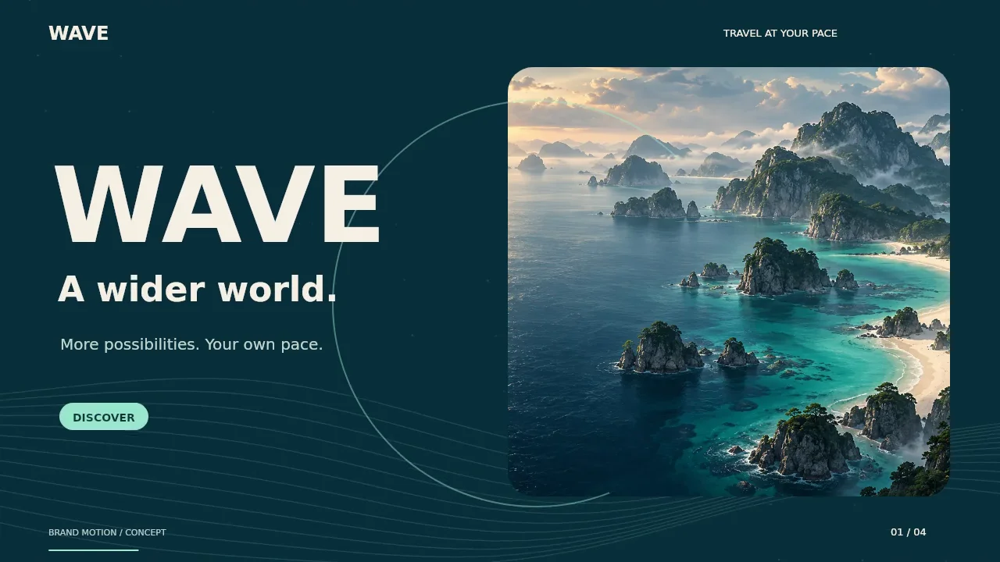

# WAVE Motion Kit v2 — Explore at your pace

2026-09-07. 사용자 요청: 기존 확대·축소 영상보다 역동적인 인트로/소개 영상과 추가 이미지. 이미지 3종, 소개 영상, 무문자 배경 영상, GIF 및 편집 소스를 전달한다. 현재 Production에 적용된 자료가 아니다.

## 바로 보기

- [20초 소개 모션그래픽](wave-intro-film.mp4) — 큰 타이포그래피 등장, 와이프 전환, 카드 펼침, 진행 경로와 움직이는 파도 선. 1280×720, 24fps, 무음.
- [12초 무문자 히어로 영상](wave-hero-motion.mp4) — 독립적으로 움직이는 카드 3장·파도 선·궤적. 왼쪽에 HTML 제목/CTA를 놓는 배경. 1280×720, 24fps, 무음.
- [5초 경로 모션 GIF](wave-route-motion.gif) — 개념적인 여행 발견→계획→출발의 연결. 640×360, 12fps. 실제 길찾기 결과·UI 녹화가 아니다.
- [한국어 설명 자막](intro.ko.vtt), [편집·재렌더링 소스](render-motion.mjs), [프롬프트](PROMPTS.md), [해시와 규격](manifest.json).

## 추가 이미지

| 파일 | 용도 | 표현 범위 |
| --- | --- | --- |
| [coast-dawn.webp](coast-dawn.webp) | 몰입형 인트로, 캠페인 표지 | 가상 해안 콘셉트. 경남 실경이나 정확한 지형으로 표시하지 않음. |
| [garden-discovery.webp](garden-discovery.webp) | 여행지 발견·동행 서비스 소개 | 가상 정원과 여행자. 실제 시설 접근성 인증 근거로 사용하지 않음. |
| [harbor-night.webp](harbor-night.webp) | 야간 테마, 소개 마지막 CTA | 가상 항구. 실제 관광지 사진과 구분. |

## 연출과 참고 범위

[카카오 공식 홈페이지](https://www.kakaocorp.com/page/)를 2026-09-07 직접 열어 큰 타이포그래피, 스토리텔링, 영상과 카드, 재생 제어를 확인했다. 한화오션 공식 홈페이지는 검색에서 확인했으나 브라우저는 502로 실제 영상 검증을 완료하지 못했다. 해당 기업 영상·캐릭터·로고·음원·코드는 가져오지 않았다. 게임 사이트의 몰입형 도입부라는 사용자 방향을 WAVE 자체 장면과 움직임으로 해석했다.

생성 도구는 이미지 3장의 제작에만 사용했다. 영상은 오프라인 Canvas+FFmpeg로 직접 설계한 모션그래픽이다. 일러스트 속 사람이나 바다가 프레임마다 새로 생성되는 영상 모델 결과가 아니다. 별도 모델 API·유료 크레딧·외부 영상 생성 서비스는 사용하지 않았다. 무음이므로 음악 라이선스는 포함하지 않는다.

## 한국어 웹 적용 문안

소개 영상의 영문은 브랜드 콘셉트용이다. 실제 한국어 랜딩은 무문자 배경 영상에 아래 문안을 HTML로 표시한다. 소스에 한국어 지원 폰트를 연결해 한국어 영상으로 재렌더링할 수도 있다. 폰트를 임의 유료 구매하거나 출처 불명으로 포함하지 않는다.

| 구간 | 화면 메시지 | 기능 연결 |
| --- | --- | --- |
| 첫 화면 | 내 속도로 떠나는 경남 여행 | 여행 시작 CTA, 첫 진입부터 이용 가능 |
| 발견 | 필요한 편의를 고르고, 나에게 맞는 여행지를 찾아요 | 실제 조건 선택·제공 정보 |
| 계획 | 가고 싶은 곳을 모아, 일정과 이동을 준비해요 | 실제 일정·경로 상태 |
| 마무리 | 함께 떠날 다음 여행을 시작하세요 | 현재 배포된 여행 플래너 |

원본 영상의 추상 경로는 장식이며 지도·거리·안전성·무장애 경로 성공을 뜻하지 않는다. 실제 기능 설명은 검증된 제품 화면을 이어 붙여 완성한다. 클라우드 저장/카카오 로그인은 #350/#351 배포 전 출시 기능으로 표현하지 않는다.

## 구현 담당자 적용 조건

- #288 최신 소유자와 #257/#259 소유 PR을 먼저 확인. #334 안정화 후 현재 브랜치에 필요한 파일만 가져온다. 자산 브랜치 전체를 병합하지 않는다.
- 첫 화면을 20초 영상 시청으로 잠그지 않는다. 브랜드 영상은 선택 재생, 웹 히어로는 포스터 기본과 명확한 재생·정지 제어를 제공한다.
- 모바일은 영상 전체를 축소해 작은 글씨를 보여주지 않고 HTML 제목과 이미지/영상 영역을 분리한다.
- 무문자 배경 영상은 `hero-poster.webp`, 소개 영상은 `intro-poster.webp`, GIF 대체는 `route-poster.webp` 사용.
- `prefers-reduced-motion`/데이터 절약 모드에서는 source를 연결하지 않고 포스터만 표시한다. 사용 중 환경 설정 변경도 반영한다.
- GIF는 정지 제어가 제한되므로 웹에서는 MP4/DOM 모션을 우선한다. 문서에 넣을 때도 기본은 포스터+열기 링크. 모든 GIF를 자동 재생해 접근성을 해치지 않는다.
- 섹션 밖 재생 중지, 비디오 선다운로드 금지, 고정 크기로 CLS 방지. 큰 해안 이미지 3개와 영상 전체를 최초 진입에 모두 로드하지 않는다.
- 제목·본문·CTA는 HTML, 한글/영문 전환과 적절한 lang, 대비 4.5:1, 44px 조작 대상, 키보드 포커스·스크린리더 상태 보장.
- 320px·200% 확대·다크모드·오프라인·미디어 오류·재생 거부·저속 네트워크를 확인한다.
- 동일 HEAD의 관련 E2E/axe·build/performance·필수 CI·Preview·독립 QA와 Production 검증 후에만 적용 완료로 기록한다. 기존 성능 예산을 올리지 않는다.

## 검증 범위와 재현

제작 환경: Node + 설치된 `@napi-rs/canvas`, FFmpeg. `node render-motion.mjs film` 또는 `hero`; `stills`는 네 대표 장면을 출력한다. 재렌더링 환경에는 DejaVu Sans regular/bold 폰트 경로가 필요하다. 시스템 폰트를 영상에 렌더링했으며 폰트 파일은 재배포하지 않는다.

미디어 규격·전체 디코딩·대표 네 장면을 확인했다. 소개 영상 480프레임, 배경 영상 288프레임, GIF 60프레임. 실제 웹 통합·기기별 성능은 아직 검증 전이다. 배경 영상의 파도·카드·궤적은 12초 주기에 맞춰 설계했다.
